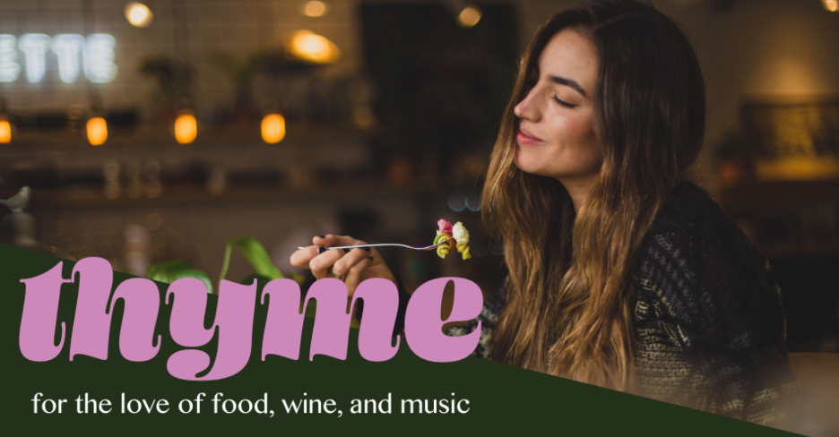

# Group 2 Project 2: THYME

Inspired by a love for cooking, Thyme is a dynamic weekly calendar that offers an immersive culinary experience with daily recipes, wine pairings, and curated playlists. We believe the best memories are cultivated when food and music transcend the evening dinner experience.

## Authors

- Devin Wulf
    - [@wulfsounds](https://github.com/wulfsounds)
- Caitlin Stevenson
    - [@caitlinscodes](https://github.com/caitlinscodes)
- Neema Velasco
    - [@nvsco-10](https://github.com/nvsco-10)
- Emily Vazquez
    - [@Emily-MVaz](https://github.com/Emily-MVaz)

## Screenshots

## 🔗 Links
- [Heroku](https://dry-garden-37593.herokuapp.com/)
- [GitHub](https://github.com/wulfsounds/g2p-thyme)

## License

[MIT](https://choosealicense.com/licenses/mit/)

