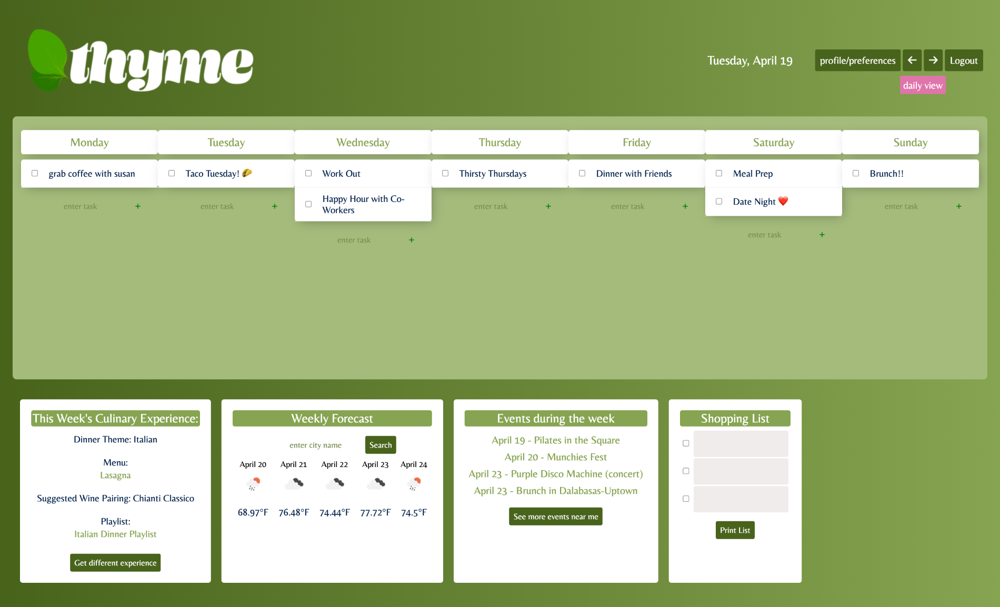
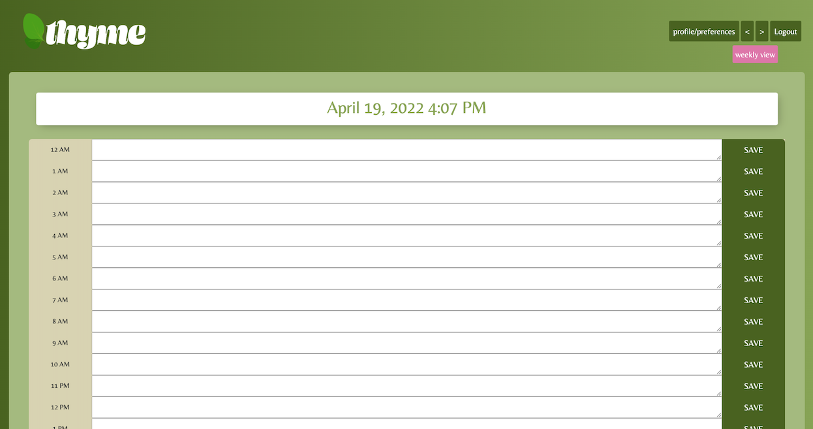

# Group 2 Project 2: THYME

[](https://opensource.org/licenses/MIT)

## Description

Thyme is a weekly calendar that uses back-end databasing using Node, Express.js, and mySQL. Front-end functionality using third-party weather API, jQuery and Moment.js. Users will have the ability to create an account, add tasks, set appointments from both weekly and daily view.

-   [Synopsis](#Synopsis)
-   [Installation](#Installation)
-   [Contributions](#Contributions)
-   [Usage](#Usage)
-   [Links](#Links)
-   [Credits](#Credits)
-   [License](#License)
-   [Questions](#Questions)

## Synopsis

Inspired by a love for cooking, Thyme is a dynamic weekly calendar that offers an immersive culinary experience with daily recipes, wine pairings, and curated playlists. We believe the best memories are cultivated when food and music transcend the evening dinner experience.

## Installation

To get started, fork this repo into a text editor, then install the node package into your repo using in the command line.

```bash
npm install
```

Once completed, open the JavaScript file titled `server.js` in the command line by right-clilcking and selecting '*Open in Integrated Terminal*' and enter the following:

Run seed first to implement data into the database..

```bash
node run seed
```
Run the server file using node..

```bash
node server.js
```

Then visit the local.host..

```
https://localhost:(PORT)
```
## Technology

MySQL
OpenWeather API
ORM
Express.js
Node.js;
Packages:
Sequelize
mySQL2
Push
Nodemon
Express-Handlebars
Handlebars
Session-Connect
Dotenv
Bcrypt
Axios
Trello (kanban)
HTML, CSS, Vanilla.js, jQuery
Insomnia
readme.so

### Design Technology


Additonal Artwork with Procreate

Procreate


## Contributions

- Devin Wulf
    - [@wulfsounds](https://github.com/wulfsounds)
- Caitlin Stevenson
    - [@caitlinscodes](https://github.com/caitlinscodes)
- Neema Velasco
    - [@nvsco-10](https://github.com/nvsco-10)
- Emily Vazquez
    - [@Emily-MVaz](https://github.com/Emily-MVaz)


## Usage






## Links 

- [Heroku](https://thyme-calendar.herokuapp.com/)

- [GitHub](https://github.com/wulfsounds/g2p-thyme)

## Credits

Photo Credits in Order of Appearance:

### Splash Page

- [Pablo Merchán Montes](https://unsplash.com/@pablomerchanm)
- [Jimmy Dean](https://unsplash.com/@jimmydean)
- [Joseph Gonzalez](https://unsplash.com/@miracletwentyone)
- [Stephanie McCabe](https://unsplash.com/@stephaniemccabe)

## License

MIT License

Copyright (c) 2022 Dev Wulf, Caitlin Stevenson, Neema Velasco, Emily Vazquez

Permission is hereby granted, free of charge, to any person obtaining a copy
of this software and associated documentation files (the "Software"), to deal
in the Software without restriction, including without limitation the rights
to use, copy, modify, merge, publish, distribute, sublicense, and/or sell
copies of the Software, and to permit persons to whom the Software is
furnished to do so, subject to the following conditions:

The above copyright notice and this permission notice shall be included in all
copies or substantial portions of the Software.

THE SOFTWARE IS PROVIDED "AS IS", WITHOUT WARRANTY OF ANY KIND, EXPRESS OR
IMPLIED, INCLUDING BUT NOT LIMITED TO THE WARRANTIES OF MERCHANTABILITY,
FITNESS FOR A PARTICULAR PURPOSE AND NONINFRINGEMENT. IN NO EVENT SHALL THE
AUTHORS OR COPYRIGHT HOLDERS BE LIABLE FOR ANY CLAIM, DAMAGES OR OTHER
LIABILITY, WHETHER IN AN ACTION OF CONTRACT, TORT OR OTHERWISE, ARISING FROM,
OUT OF OR IN CONNECTION WITH THE SOFTWARE OR THE USE OR OTHER DEALINGS IN THE
SOFTWARE.

## Questions

For questions, contact us through <a href="https://github.com/wulfsounds">Github!</a>


